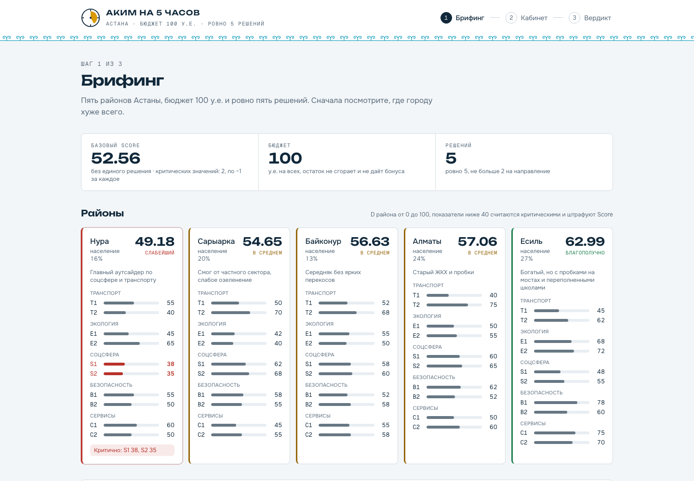
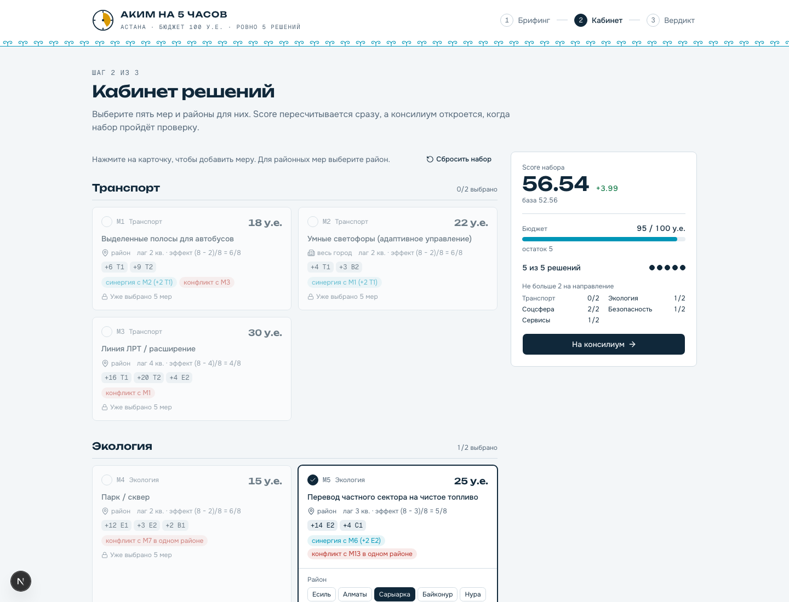
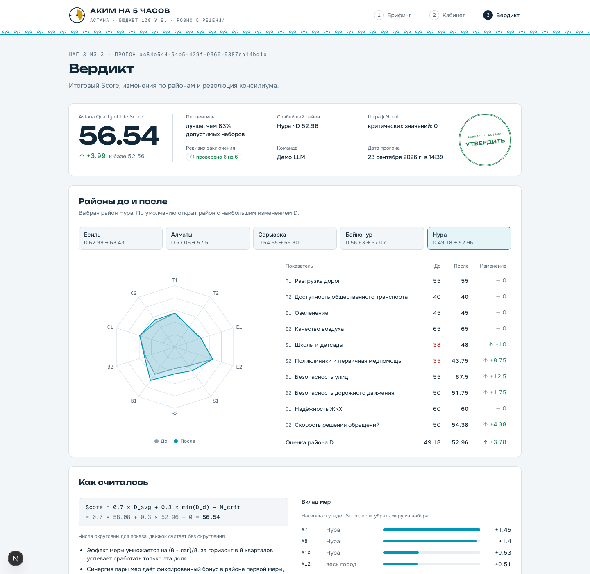

# Аким на 5 часов

AI-симулятор управления городом для кейса HackAlem AI. Игрок получает бюджет 100 условных единиц, данные по пяти районам Астаны и каталог из 14 мероприятий, принимает ровно пять решений и получает **Astana Quality of Life Score** с объяснением от консилиума AI-агентов: что усилилось, чем рискуем, какие последствия и что стоит поменять.

## 1. Краткое описание

**Проблема.** Городской управленец распределяет ограниченный бюджет между транспортом, экологией, соцсферой, безопасностью и сервисами. Каждое решение сдвигает десятки показателей, и последствия набора решений трудно оценить в голове.

**Для кого.** Городские управленцы, аналитики, студенты и участники деловых игр, которым нужно быстро прогнать сценарий, увидеть его цену и услышать аргументы «за» и «против».

**Принцип.** Код считает, LLM говорит. Валидация, Score, дельты по районам, поиск улучшений и исход резолюции считаются детерминированно. Языковая модель получает пронумерованные факты и объясняет их, спорит и пишет резолюцию. Ни одно число не приходит из модели, и это проверяется кодом.

## 2. Что реализовано

- Единый бюджет 100 и синтетический датасет организаторов: 5 районов, 10 показателей, 14 мер с ценой, лагом и эффектами, 3 синергии, 3 несовместимости.
- Валидатор восьми правил кейса, возвращает все нарушения списком: ровно 5 решений, бюджет, повторы, район для локальных мер, не более 2 мер на направление, конфликты.
- Движок Score по формуле датасета: лаг, синергии, обрезка 0..100, веса, штраф за критические значения. Золотой тест воспроизводит базу 52.56 и пример организаторов 56.54.
- Факты с ID (`F1…Fn`): каждое изменение показателя, вклад каждой меры, слабейший район, критические значения, остаток бюджета.
- Оптимизатор соседей: перебирает все замены одной меры, отдаёт до трёх валидных улучшений и лучший достижимый Score.
- Консилиум из восьми стадий: 6 экспертов (транспорт, экология, соцсфера, безопасность, сервисы, финансы) параллельно → синтезатор → ревизоры (6 условий, порог 5 из 6, до 2 кругов пересмотра) → арбитр с резолюцией «утвердить / утвердить с условиями / вернуть».
- Стриминг прогресса по SSE, сохранение прогона в JSON, страница результата открывается по ссылке.
- Режим без ключа OpenAI: движок и оптимизатор работают, консилиум отвечает детерминированным фолбэком с пометкой.

## 3. Как работает решение

1. **Брифинг** (`/`): пять плиток районов, базовый Score 52.56, два критических провала Нуры (школы 38, поликлиники 35). Команда вводит название.
2. **Кабинет решений** (`/play`): каталог мер по пяти направлениям, выбор района, бюджетная полоса, лимиты по направлениям, живой Score прямо в браузере тем же движком. Невалидный набор блокирует отправку и называет причины.
3. **Вердикт** (`/result/[runId]`): Score и дельта, радар района до и после, таблица показателей, зал заседаний с карточками экспертов, табло ревизоров, историей черновиков и резолюцией арбитра с поручениями. Кнопка «Применить поручение» подставляет улучшение и запускает новый прогон.

| Брифинг | Кабинет решений | Вердикт |
|---|---|---|
|  |  |  |

Полная страница вердикта с залом заседаний: [docs/screenshots/verdict-full.png](docs/screenshots/verdict-full.png).

```
Сценарий → Валидатор → Движок + Факты → Оптимизатор
        → 6 экспертов (LLM, параллельно) → Синтезатор (LLM)
        → Ревизоры: C1, C2 код · C3–C6 LLM ──┐ провал, круг ≤ 2
                 ↑___________________________│
        → Таблица исходов (код) → Арбитр (LLM) → Запись прогона → SSE done
```

## 4. Технологии

- Next.js 16.3 (App Router, route handlers, SSE), React 19.2, TypeScript 5
- Tailwind 4 + shadcn/ui, Recharts 3, lucide-react
- Vercel AI SDK 7 + `@ai-sdk/openai` 4, structured outputs через zod 4 (strict JSON schema)
- OpenAI API: эксперты на `gpt-5.4-mini`, синтезатор, ревизоры и арбитр на `gpt-5.5` (меняется в `.env`)
- Vitest 5, Docker (standalone-сборка Next)

## 5. Архитектура

```
src/lib/data/        датасет как константы (районы, меры, веса, синергии, конфликты)
src/lib/engine/      validator, engine (Score), facts (факты с ID), optimizer — чистые функции
src/lib/consilium/   llm (единая точка вызовов), experts, synthesizer, reviewers, arbiter, pipeline
src/lib/store/       прогоны в JSON: data/runs/<id>.json
src/app/api/run      POST → поток событий ConsiliumEvent (SSE)
src/app/api/runs     GET список и GET по id
src/app/             брифинг, кабинет, вердикт
src/lib/types.ts     контракт между UI и бэком
fixtures/            полный образец прогона для разработки UI
```

| Что | Кто делает | Почему |
|---|---|---|
| Валидация, Score, дельты, вклад мер | код | воспроизводимость, критерии 2, 3, 5 кейса |
| Поиск улучшений, лучший Score | код | перебор дешевле и точнее любой модели |
| Мнения экспертов, черновик, споры, резолюция | LLM | нужен язык, а не арифметика |
| Проверка чисел в тексте (C1), валидность рекомендации (C2) | код | LLM не проверяет сам себя там, где может код |
| Полнота и честность текста (C3–C6) | LLM-ревизор | условия, а не «оценка уверенности» |
| Исход резолюции | код, таблица условий | один ответ на вопрос «почему утвердили» |

## 6. Установка и запуск

```bash
git clone https://github.com/BAITC-Hacks/hack-4fbaf6fd-hahatun.git
cd hack-4fbaf6fd-hahatun
yarn install
cp .env.example .env        # вписать OPENAI_API_KEY, без него работает фолбэк
yarn dev                    # http://localhost:3000
```

Docker:

```bash
cp .env.example .env
docker compose up --build   # http://localhost:3000, прогоны в volume runs
```

Проверки: `yarn test` (движок, валидатор, ревизоры, пайплайн), `yarn typecheck`, `yarn lint`.

## 7. Как проверить решение

**Через интерфейс**
1. Открыть `/play`, собрать пример организаторов: M7 Нура, M8 Нура, M10 Нура, M12, M5 Сарыарка. Стоимость 95, живой Score показывает **56.54** (в документе кейса ≈ 56.5).
2. Заменить M5 на M3 (ЛРТ) в Нуре: Score меняется на **57.21**. Убрать одну меру: кнопка блокируется, причина «нужно ровно 5 решений». Добавить M3 при выбранной M1: причина «несовместимы».
3. Нажать «На консилиум». В зале заседаний появляются шесть экспертов, черновик, табло ревизоров, резолюция. С ключом прогон занимает 30–60 секунд и стоит около 4 центов; без ключа около секунды, тексты помечены как фолбэк.

**Через API** (сервер на 3000):

```bash
curl -N -X POST http://localhost:3000/api/run -H 'Content-Type: application/json' \
  -d '{"teamName":"Демо","scenario":{"decisions":[{"measureId":"M7","districtId":"nura"},{"measureId":"M8","districtId":"nura"},{"measureId":"M10","districtId":"nura"},{"measureId":"M12"},{"measureId":"M5","districtId":"saryarka"}]}}'
```

Ожидаемый поток: `stage validate/engine/optimize`, событие `engine` со `score: 56.54` и 32 фактами, `optimizer` с улучшением «M5 Сарыарка → M3 Линия ЛРТ, Нура, 57.21», шесть событий `expert`, `draft`, `review` (с ключом обычно 6 из 6), `resolution` с исходом `approve` и поручением, `done` с `runId`. Затем `GET /api/runs/<runId>` возвращает сохранённый прогон. Реальный прогон с LLM сохранён как образец в `fixtures/live-run.json`.

**Тесты:** `yarn test` — 62 теста, среди них золотой тест формулы (база 52.56, пример 56.54, синергия M10+M12), валидатор по каждому правилу, проверка чисел ревизора C1, цикл пересмотра с cap 2, хранилище с защитой от path traversal.

## 8. Данные и интеграции

- Синтетический датасет организаторов (`docs/source/dataset.md`), перенесён в код без изменений. Персональных данных нет.
- OpenAI API через Vercel AI SDK. Ключ только в `.env`, в репозитории его нет.
- Внешних БД и сервисов нет, прогоны хранятся файлами.

## 9. Ограничения

- Оптимизатор перебирает соседей по одной замене, а не все наборы. Перцентиль считается среди соседей.
- Ревизия ограничена двумя кругами, после них результат отдаётся с бейджем «проверено N из 6».
- Один город, один датасет, без авторизации и мультиплеера. Лидерборд не реализован.
- Мобильная вёрстка не приоритет, целевой экран от 1024px.

## 10. Потенциал развития

- Реальные данные районов и открытые источники акимата вместо синтетики.
- Замена LLM-ревизоров быстрым классификатором (например, Laya на ModernBERT) после накопления размеченных вердиктов.
- Внезапные события с перераспределением бюджета, сравнение команд, экспорт презентации.
- Вход по ЭЦП через NCA Node для внедрения в акимате.

## 11. Развёрнутая версия

<!-- ссылка, если будет -->
Пока нет, запуск локально или через Docker.

## Команда

Амир Баурзханов — движок, консилиум, API, README. Мирас — интерфейс.
